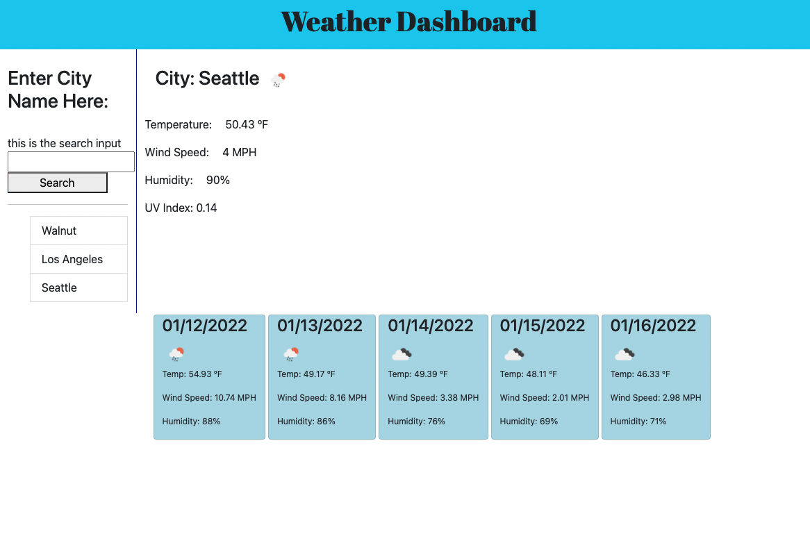

## Weather Dashboard

In this assignment, a weather dashboard was created. The user searched for a city, and the current weather for that city is shown, as well as the forecast for the following 5 days. The user's searched cities are stored to local storage, and displayed below the search input.

## Completed Assignment

This image shows the completed assignment's appearance, and functionality:

## Link to Deployed Site
